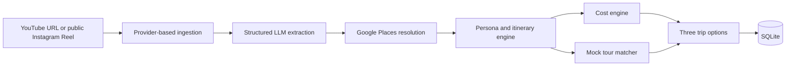

# Reel2Route

Reel2Route turns a saved YouTube travel video or public Instagram Reel into three explainable, persona-led trip plans. It keeps the original content visible in the result: every extracted place carries evidence and confidence, while missing information, estimated costs, mock tours, bookability, and packing advice are labelled rather than presented as facts.

## Product flow



The extraction result includes places, activities, vibes, destination guess, source evidence, mention count, confidence, and a missing-information report. Only Google-resolved places enter an itinerary. The rest of the planning pipeline is deterministic so that the same analysis and preferences produce explainable plan differences.

## Repository structure

```text
reel2route/
├── apps/
│   ├── api/                 # Express API and domain modules
│   │   ├── data/tours.json  # 24-item mock tour catalogue
│   │   ├── src/modules/     # Ingestion through persistence
│   │   └── test/
│   └── web/                 # React + Vite user experience
├── packages/
│   └── contracts/           # Shared Zod schemas and inferred types
├── docs/
│   ├── TEST_CASES.md
│   └── COST_ESTIMATE.md
└── .env.example
```

## Run locally

### Requirements

- Node.js 24 or newer
- npm 11 or newer
- A [YouTube Data API v3 key](https://developers.google.com/youtube/v3/getting-started)
- An [OpenAI API key](https://platform.openai.com/api-keys)
- A [Google Places API key](https://developers.google.com/maps/documentation/places/web-service/get-api-key) with Places API (New) enabled and billing configured

### Setup

```bash
git clone <repository-url>
cd reel2route
npm install
cp .env.example .env
```

Fill in the three API keys in `.env`, then start both workspaces:

```bash
npm run dev
```

The web app runs at `http://localhost:5173` and the API at `http://localhost:4000`. The SQLite file is created at `apps/api/data/reel2route.sqlite` by default. No deployment, Redis, or external database is required.

### Environment variables

| Variable | Required | Purpose |
| --- | --- | --- |
| `YOUTUBE_API_KEY` | For YouTube | Title, description, author, and publish date |
| `OPENAI_API_KEY` | Yes | Structured place/activity extraction |
| `OPENAI_MODEL` | No | Defaults to `gpt-5-mini` |
| `GOOGLE_PLACES_API_KEY` | Yes | Place validation and enrichment |
| `PORT` | No | API port; defaults to `4000` |
| `WEB_ORIGIN` | No | Allowed browser origin |
| `DATABASE_PATH` | No | SQLite path relative to `apps/api` |

## Worked YouTube example

Use Jules Anderson's [5 days in Paris, France travel vlog exploring ALL the sights & hidden gems](https://www.youtube.com/watch?v=bzch3VfNREA). It has public captions, day-by-day chapters, and a useful mix of landmarks, neighbourhoods, museums, cafés, gardens, and activities. With the app running:

```bash
curl --request POST http://localhost:4000/api/trips \
  --header 'Content-Type: application/json' \
  --data '{
    "url": "https://www.youtube.com/watch?v=bzch3VfNREA",
    "preferences": {
      "origin": "London",
      "days": 5,
      "budgetRange": "moderate",
      "groupType": "couple",
      "pace": "balanced"
    }
  }'
```

The live response depends on current source metadata and Google Places results. A successful response contains:

- source evidence for extracted mentions such as the Eiffel Tower, Arc de Triomphe, Musée d'Orsay, Montmartre, Sacré-Cœur, Versailles, and the Louvre;
- Google place ID, coordinates, category, rating, and price level where available;
- Budget Explorer, Comfort Traveller, and Premium Escape options;
- five cost categories and a per-person total in USD;
- up to two relevant mock tours per stop, a bookability score, and packing advice;
- a trip ID that can be loaded with `GET /api/trips/:tripId`.

See [the documented test cases](docs/TEST_CASES.md) for representative outputs and caveats.

## API

| Method | Route | Purpose |
| --- | --- | --- |
| `GET` | `/api/health` | Service health |
| `POST` | `/api/ingestions` | Fetch normalized source content |
| `POST` | `/api/analyses` | Ingest, extract, and resolve places |
| `POST` | `/api/trips` | Run the full pipeline and persist its result |
| `GET` | `/api/trips/:tripId` | Retrieve a saved trip |

Invalid input and known domain failures return a consistent JSON error response. Shared Zod contracts validate data at API and provider boundaries.

## Architecture decisions

1. **React + Vite for the web app.** Express already owns the server boundary. Vite keeps this local, client-side experience smaller than a second full-stack framework while still supporting a polished multi-stage flow in one application route.
2. **Express 5 for orchestration.** The API exposes the pipeline clearly, keeps provider credentials off the client, and allows each stage to be tested behind a small interface.
3. **npm workspaces without Turborepo.** Three workspaces do not yet justify another task runner or package manager. Root scripts already provide one-command development, tests, linting, type-checking, and builds.
4. **A contracts package.** Zod schemas are runtime API boundaries and the source of TypeScript types. This prevents the frontend and backend from silently describing different payloads.
5. **Provider adapters and dependency injection.** YouTube, Instagram, OpenAI, and Google Places are isolated behind small ports. Tests substitute in-memory fakes without network calls, and a provider can be replaced without rewriting planning logic.
6. **One constrained LLM stage.** The model extracts structured evidence; itinerary ordering, personas, costs, tour ranking, packing, and bookability are deterministic. This limits cost and makes plan decisions reviewable.
7. **Real place validation, mocked tours.** Google Places verifies geography. The tour catalogue is deliberately marked `mock`; entries are hard-filtered by destination, persona, and budget before ranking. Unsupported stops receive no named inventory, which is safer than an irrelevant match.
8. **SQLite persistence.** It is enough for a local take-home, needs no service setup, uses prepared statements and WAL mode, and can be replaced behind the repository interface. Node's built-in SQLite API is still marked [release candidate in current Node 24 documentation](https://nodejs.org/download/release/latest-v24.x/docs/api/sqlite.html), so Postgres would be the production migration target.
9. **No Redis yet.** A cache adds an operational dependency without improving this local demonstration. Production should cache normalized URL analyses and Google place resolutions after measuring hit rate and staleness needs.
10. **Costs are estimates, not quotes.** Monetary values use integer minor units. Each line carries an assumption and confidence so indicative flights and stays cannot be mistaken for live prices.

## Quality checks

```bash
npm test
npm run lint
npm run typecheck
npm run build
```

Tests cover URL parsing, provider fallbacks, prompt/output validation, place resolution, personas, itinerary construction, costs, tour ranking, persistence, routers, and the composed API.

## Known limitations

- Instagram ingestion reads public Open Graph metadata only. Instagram may require login, change markup, rate-limit requests, or remove a Reel. The app never downloads media and therefore cannot inspect video frames for visible text or location stickers.
- YouTube transcripts depend on public caption availability and a non-official transcript adapter. A video can still be analysed from metadata when captions are unavailable.
- Place resolution uses text search and a simple ambiguity policy; similarly named venues can require user confirmation in a production product.
- Flight, accommodation, food, and local-transport amounts are persona heuristics, not dated inventory. Tours are realistic mock records and are not bookable.
- The five-question brief omits travel dates and party size. The UI reports those gaps instead of inventing precision; totals are per person.
- There is no authentication, background job queue, retry dashboard, or multi-instance database strategy because the assignment is local-only.
- Public content, model output, API pricing, and place records change. Re-run the three documented cases immediately before recording the walkthrough.

The 100K-MAU operating model is documented in [docs/COST_ESTIMATE.md](docs/COST_ESTIMATE.md).
